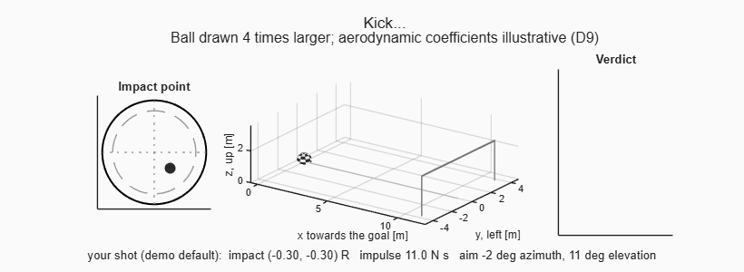

```
 █████╗ ███████╗███████╗██╗███████╗████████╗
██╔══██╗██╔════╝██╔════╝██║██╔════╝╚══██╔══╝
███████║███████╗███████╗██║███████╗   ██║
██╔══██║╚════██║╚════██║██║╚════██║   ██║
██║  ██║███████║███████║██║███████║   ██║
╚═╝  ╚═╝╚══════╝╚══════╝╚═╝╚══════╝   ╚═╝

        e sei di nuovo protagonista
```

# /assist — engineering co-development with an AI

A Claude Code skill that turns the way you work with an AI on scientific/engineering code into a
repeatable workflow. **Claude writes the code; you own every engineering decision**, and you finish
able to defend the design in front of a reviewer.

MATLAB first (Live Scripts, `matlab.unittest`), Python as a variant (percent-format notebook, pytest).
It fits a Model-Based Design process: block architecture with I/O contracts, requirements traced to
tests, optional Simulink/System Composer mapping.

## The workflow

| # | Phase | Command | Result |
|---|---|---|---|
| 0 | Audit an existing project | `/assist audit` | first proposes which of your existing docs to use for context (you tick the boxes), and keeps a short digest with pointers, then block map, parameter inventory, gap table (originals untouched) |
| 1 | Brainstorm & requirements | `/assist brainstorm` | `docs/assist/spec.md`, decisions logged |
| 2 | Block architecture | `/assist architecture` | block chain, I/O contract per block, traceability matrix |
| 3 | Plan | `/assist plan` | `docs/assist/plan.md` with stop points and falsifiable checks |
| 4 | Build block by block | `/assist build` | tests first, code to the coding standards, one block per turn |
| 5 | Engineering docs | `/assist docs` | guide README, theory with index, references, parameters |
| 6 | Walkthrough demo | `/assist demo` | Live Script that exercises every block in order |
| 7 | Guided review | `/assist review` | Claude explains each demo section and checks your understanding |
| 8 | Close | `/assist close` | checklist, test count with date, commit proposal |

`/assist` alone reads `docs/assist/STATE.md` and resumes where the project stands.

## Principles
Code to Claude, decisions to you (logged as D1, D2, …) · one block at a time · one parameters file, no
hidden defaults · every equation traceable to a source and a test · captions state only what was
measured · no long runs on your behalf · never modify originals · explanations that start from the
physics · the cheapest model that can do each delegated task, and other agent CLIs only if you say yes · in the
review, understanding is checked with interactive prompts, right answers are rewarded and wrong ones are verified
against the code or a source before they are explained.

## Example: a Live Script generated with the skill



*Three kicks replayed by the last step of the demo: where the foot hits the ball, the flight in slow motion with
the ball turning at its spin rate, and the verdict on the goal (green: goal, red: anything else). The values of each
kick are written under the picture.*

[`examples/penalty_kick/`](examples/penalty_kick/) is a whole `/assist` run on a deliberately silly project: kick a
football at a goal and see what the physics does. **The Live Script
[`PenaltyKickWalkthrough.m`](examples/penalty_kick/examples/PenaltyKickWalkthrough.m) was generated with the skill**,
together with the requirements, the architecture, the plan, the code and the tests behind it. Claude wrote them; the
author took every engineering decision (14 of them, logged in `DECISIONS.md`, one of them a reversal of an earlier choice).

The demo is written for study: one part per block, each with its inputs first, a figure, a numeric check printed
(for example `range without air: 16.7537 m, analytic 2*vh*vz/g = 16.7537 m, relative error 2.1e-16`) and a line on what to observe.
Its last step, **Your shot**, has five sliders for the impact point, strength and aim of the kick.

### Then the skill teaches it to you
Generating the demo is not the end. `/assist review` opens an **interactive dialogue** that walks the Live Script
section by section until you can defend the design:

1. Claude frames the section and explains the **physical sense** first (what the physics guarantees), then the numerical
   method and the **real lines of code**, then where it breaks. You ask whatever is not clear; the answers come from
   the code and from the sources in `REFERENCES.md`, not from memory.
2. The questions that check your understanding appear as **interactive multiple-choice prompts**, not as text in the
   chat. The wrong options are the real misconceptions (the answer that looks right, the quantity that scales
   differently); none is marked as recommended, and a free-text answer is always possible.
3. **A right answer is rewarded**: Claude says why it is right, names what exactly you got right (the trap you avoided)
   and shows where you stand. **A wrong answer is first checked**: Claude verifies against the code, a test or a source
   that it really is wrong (you may be right, and then it is a bug or a decision to log), and only then explains again
   from the bibliography or from a simulation of the project's own code, with numbers you can reproduce.
4. When the same slip comes back, Claude names the pattern and gives you the key that ends it. The tally of right and
   wrong answers is kept exactly in `docs/assist/REVIEW_LOG.md`, so the progress shown to you is never inflated.
5. You move on with "next", or validate a section yourself. A bug found on the way goes back to the build phase with a
   regression test, and a decision you change updates `DECISIONS.md` and everything downstream of it.

It works best with the demo run on your own screen: if a figure disagrees with the explanation, yours wins and it
becomes a finding.

**On this example** the review was run on sections 1 to 4 of 7 (13 questions answered, 7 right); the author validated
the flow and stopped there. The log is in [`REVIEW_LOG.md`](examples/penalty_kick/docs/assist/REVIEW_LOG.md). One slip
came back three times, applying "energy is conserved" to a system that was not closed, and the question "which system
is the balance written for?" ended it. The review also found that the equations on the first page had no source:
[`REFERENCES.md`](examples/penalty_kick/REFERENCES.md) now lists each one with the equation number read on the page,
what the project derives itself, and what has no source.

### What the skill leaves behind, on this example
The architecture of the example, a chain of three blocks with one parameters file:

```
 shot ──► [1] kickImpact ──► launch ──► [2] flightDynamics ──► traj ──► [3] classifyShot ──► result
 (user)    impulse, spin     v0, ω0      gravity, drag, Magnus   path     goal geometry       GOAL, POST, …
                                         parameters.m: one file, one sub-struct per block
```

| Phase | What the skill produces | In the example |
|---|---|---|
| 1 Brainstorm | intent, numbered requirements each with a way to verify it, constraints, known limits; every choice logged as D1, D2, … with the options considered | [`spec.md`](examples/penalty_kick/docs/assist/spec.md), [`DECISIONS.md`](examples/penalty_kick/docs/assist/DECISIONS.md) |
| 2 Architecture | block diagram, a contract per block (purpose, inputs and outputs with units and frame, parameters, assumptions, theory, test), the data passed between blocks field by field, a traceability matrix | [`architecture.md`](examples/penalty_kick/docs/assist/architecture.md) |
| 3 Plan | tasks per block, stop points, checks whose pass criterion is written **before** measuring, what is out of scope | [`plan.md`](examples/penalty_kick/docs/assist/plan.md) |
| 4 Build | one function per block with a header (physical context, theory, units, assumptions, example), inputs validated, no model parameter hidden as a default in a function, one parameters file | [`src/`](examples/penalty_kick/src/), [`parameters.m`](examples/penalty_kick/parameters.m) |
| 4 Tests | one test class per block, tests named after the requirement they check, written before the code | [`tests/`](examples/penalty_kick/tests/): 51 tests in 8 classes |
| 6 Demo | the Live Script above | [`examples/`](examples/penalty_kick/examples/) |
| every step | where the project stands, what is next, open questions | [`STATE.md`](examples/penalty_kick/docs/assist/STATE.md) |
| 5 Docs | guide README, theory with index, references, parameters | [`REFERENCES.md`](examples/penalty_kick/REFERENCES.md) only; the guide README and the theory notes are not yet produced |
| 7 Review | a log with one row per demo section, the tally of questions, the bugs and the gaps found | [`REVIEW_LOG.md`](examples/penalty_kick/docs/assist/REVIEW_LOG.md), sections 1 to 4 |

The tests are not decoration; they are tied to the physics. One requirement, followed through the files:

| Requirement | Block | Test | What it checks |
|---|---|---|---|
| R3: the Magnus force does no work | 2, `flightDynamics` | `R3_magnusOnlyConservesMechanicalEnergy` in `tFlightDynamics` | with that force alone the mechanical energy stays constant: drift measured 8e-15, criterion 1e-6 |

Other tests check a closed form (the flight without air equals the parabola), a symmetry (opposite impact points mirror
each other), the failures the code promises (an impact point beyond the ball is refused), and the link between pieces:
`tWalkthroughControls` reads the Live Script and fails if a slider limit stops matching `parameters.m`. Two things
went wrong during the build and show what the loop is for: a requirement was worded wrongly (energy, not speed, is
conserved) and was corrected in the spec rather than in the tolerance (decision D12); and a rounding error that
let an impact point land one unit in the last place outside its limit was found, then pinned by a seeded regression
test.

To run it, open the Live Script in MATLAB with `examples/penalty_kick/examples` as the current folder. The sliders
are controls of the Live Editor: releasing one re-runs the section and replays the kick. The GIF above is inspired by the
Live Script ([`tools/makeShotVideo.m`](examples/penalty_kick/tools/makeShotVideo.m) draws it).

## Install

Claude Code only looks for skills in fixed places: `~/.claude/skills/` (yours, for every project) and
`.claude/skills/` inside a project. A repository cloned anywhere else is not scanned, so installing means one
extra step: make the skill folder show up in `~/.claude/skills/`.

### The easy way: let your agent do it
1. Clone this repository anywhere you keep your tools:
   ```sh
   git clone https://github.com/donninidiego/assist-skill.git
   ```
2. Open your AI coding agent in that folder and say: **"install the assist skill from this repo"**. The agent
   follows the runbook in [For AI agents](#for-ai-agents-download-and-initialize-the-skill) below.
3. Open a **new session** (skills load when a session starts) and type `/assist`. The ASSIST banner appears.

### The manual way
After cloning (step 1 above), from the folder that contains `assist-skill/`, create a link so that
`~/.claude/skills/assist` points to the cloned skill. A link, not a copy: `git pull` then updates the skill.

```bat
:: Windows (junction, no admin needed)
mkdir "%USERPROFILE%\.claude\skills" 2>nul
mklink /J "%USERPROFILE%\.claude\skills\assist" "%CD%\assist-skill\skills\assist"
```
```sh
# macOS / Linux
mkdir -p ~/.claude/skills
ln -s "$(pwd)/assist-skill/skills/assist" ~/.claude/skills/assist
```
Then open a new session and type `/assist`. If linking is not possible, copy the folder
`assist-skill/skills/assist` to `~/.claude/skills/assist` instead (updates are then manual).

### Other options
- **As a plugin:** add this repo as a plugin source; the skill is then namespaced (`assist-workflow:assist`).
- **For one project only:** link or copy the same folder into that project's `.claude/skills/assist` instead.
- **Recommended companion:** the `superpowers` plugin (`/plugin install superpowers@claude-plugins-official`).
  /assist uses its brainstorming, planning and TDD skills when present and falls back to a condensed
  built-in process otherwise.

## Starting a project: three examples
Type `/assist` in the folder where the project lives or will live. The skill looks at the folder and picks the start
(the routing is in [`SKILL.md`](skills/assist/SKILL.md)); whichever it is, each step ends at a gate and nothing moves on
without your approval.

| You have | First phase | You get first |
|---|---|---|
| nothing but an idea | 1, brainstorm | `spec.md`, `DECISIONS.md`, `REFERENCES.md` |
| a folder with documents (papers, notes, specs) | context intake, then 1 | `CONTEXT.md`, then the same |
| an existing repository | 0, audit | the "As-is" map in `architecture.md`, open questions in `STATE.md` |

### 1. From scratch: only a prompt
The folder is empty and you give the idea in one line:
```
/assist simulate a pendulum with friction and show where the energy goes
```
The skill starts the **brainstorm**. It asks one question at a time (why this exists, who uses the result, what
success looks like) and writes back what it understood for you to correct. Then it **looks for the bibliographic
sources by itself**: it searches, opens the page of each candidate, reads the equation it would use together with its
number, and proposes the list for you to confirm, saying what it could not open. A source it did not open is never
listed. It then proposes numbered requirements, each with a way to verify it, and logs each modelling choice as a
decision for you to take. The [`penalty_kick`](examples/penalty_kick/) example started like this, from one prompt in
an empty folder.

### 2. A workspace with a docs section
The folder has `docs/` (papers, notes, specifications) and little or no code:
```
/assist
```
The skill first **looks without reading**: it lists the candidate documents by name, size and date, and asks **you**
which ones to use as a reference. The proposal is a set of checkboxes grouped by role (overview, theory and
parameters, per-folder READMEs, heavy attachments such as PDFs), with a recommendation on what it would tick. It reads
exactly what you ticked, writes a short digest [`docs/assist/CONTEXT.md`](skills/assist/templates/docs/CONTEXT.md) in
which every claim points to a file and section, and treats the documents as claims, not as orders: where they
disagree with the code or with each other, it reports a finding. Then the brainstorm starts from the digest.

### 3. A repository that already exists
The folder holds code:
```
/assist
```
The skill goes through the whole repository to build context, as a classic init would, but **read-only**: your files
are never modified, and anything to reorganise is copied first. The audit produces
1. an inventory (folder tree, entry points, who calls whom, languages, toolboxes);
2. a **block map** in data-flow order, marking the files that mix several blocks;
3. a **parameter inventory** (magic numbers, defaults buried in function signatures, how many places define each);
4. a **gap table** against the standards: function headers, input validation, tests per block, READMEs, references,
   traceability, demo;
5. the **open questions** only you can answer (why this formula, which assumption is intentional).

If the repository also has documents, the intake of the second example runs first. You approve or correct the block
map; only then do goals and a target architecture come in. Nothing is guessed: what the skill cannot tell is listed as
a question.

## For AI agents: download and initialize the skill

If you are an AI coding agent and the user asked you to use `/assist`, check first whether it is already
installed, and install it only if it is not. Each step has a check; do not go on until it holds.

1. **Is it installed?** `assist` appears in your list of available skills, or the file
   `~/.claude/skills/assist/SKILL.md` exists (on Windows `%USERPROFILE%\.claude\skills\assist\SKILL.md`).
   *Check:* if yes, skip to step 5.
2. **Download.** Clone this repository next to the user's other tools, not inside a project they are working on:
   ```sh
   git clone https://github.com/donninidiego/assist-skill.git assist-skill
   ```
   *Check:* `assist-skill/skills/assist/SKILL.md` exists. If `git` or the network is unavailable, stop and tell
   the user; do not invent a copy of the skill.
3. **Install as a personal skill.** Link (preferred, so updates follow) or copy the folder
   `assist-skill/skills/assist` to `~/.claude/skills/assist`:
   ```sh
   # macOS / Linux
   mkdir -p ~/.claude/skills && ln -s "$(pwd)/assist-skill/skills/assist" ~/.claude/skills/assist
   ```
   ```bat
   :: Windows (junction, no admin needed)
   mkdir "%USERPROFILE%\.claude\skills" 2>nul
   mklink /J "%USERPROFILE%\.claude\skills\assist" "%CD%\assist-skill\skills\assist"
   ```
   If linking fails, copy the folder instead. If `~/.claude/skills/assist` already exists, **do not overwrite
   it**: ask the user.
   *Check:* `~/.claude/skills/assist/SKILL.md` is readable and its first lines contain `name: assist`.
4. **Reload.** A skill is picked up when a session starts. You cannot do this yourself: tell the user to open
   a new session (or restart Claude Code), then type `/assist`. *Check:* the ASSIST banner appears.
5. **Optional companions** (ask first, never install silently): the `superpowers` plugin and, for MATLAB
   projects, a MATLAB MCP server. At its first start `/assist` checks for superpowers by itself: if it is
   missing it asks the user, and on a yes installs it with
   `claude plugin install superpowers@claude-plugins-official` (it then loads in the next session). If the
   user declines, the skill uses its built-in condensed process.
6. **Initialize the project the user wants to work on.** In that project's root, run `/assist` with no
   argument. The skill looks for `docs/assist/STATE.md`:
   - **present:** read it and resume where the project stands;
   - **absent:** for existing code propose `/assist audit`, for an empty folder `/assist brainstorm`. On the
     first step create `docs/assist/` and copy `STATE.md` and `DECISIONS.md` from
     `~/.claude/skills/assist/templates/docs/`; ask the user the language of docs and the demo, and write it in
     `STATE.md`.
   *Check:* `docs/assist/STATE.md` exists and names the current phase and the next step.

Rules while using it: the user decides every modelling choice (you propose options, they choose, you log it in
`DECISIONS.md`); work one block at a time; never modify, delete or commit anything in the user's original
files or repositories without being asked; never run long computations on their behalf.

## Requirements
- MATLAB R2025a+ for plain-text Live Scripts (earlier versions work for everything except the demo
  format); MATLAB MCP server recommended for static checks and quick runs. Sliders in a plain-text Live Script
  were checked on R2026a Update 5 only.
- Python variant: Python 3.9+, `numpy`, `matplotlib`, `pytest`.

## Layout
```
skills/assist/
  SKILL.md              principles, phase router, state files
  references/           one file per phase + context intake, decision/review protocols, MBD integration,
                        Live Script format, Python variant, coding standards, fallback process
  templates/matlab/     parameters.m, requireFields.m, exampleBlock.m (header), tExampleBlock.m,
                        loadTestParams.m, Walkthrough.m
  templates/python/     the Python twins
  templates/docs/       STATE, CONTEXT, spec, architecture, plan, DECISIONS, REVIEW_LOG, README guide,
                        block README, theory index, REFERENCES, PARAMETERS
examples/penalty_kick/  a worked example: process files in docs/assist/, MATLAB blocks, tests, Live Script demo
                        with sliders, and tools/makeShotVideo.m that records the animation as a GIF in media/
```

## Verification status
MATLAB templates: static analysis clean, 5/5 unit tests pass, Live Script saved to `.mlx` as a valid
archive, walkthrough runs in under a second. Python templates: written to the same structure but not
executed on the authoring machine; run `pytest` once on first use.

Example `penalty_kick` (7 October 2026, MATLAB R2026a Update 5): 51 tests pass, static analysis clean on 25 files,
the demo runs in about 4 s from the command window, and MATLAB recognises its 5 sliders when the Live Script is
converted to `.mlx`. The author dragged the sliders and watched the animation in the Live Editor (7 October 2026).
The guided review was run on sections 1 to 4 of 7 and validated by the author. Not yet done: the guide README and
the theory notes of that example, and sections 5 to 7 of the review.

## Origin
Distilled from a research-software project built plan
first with an AI, documented as an engineering guide, and studied by its author through a step-by-step
Live Script demo. License: MIT.
